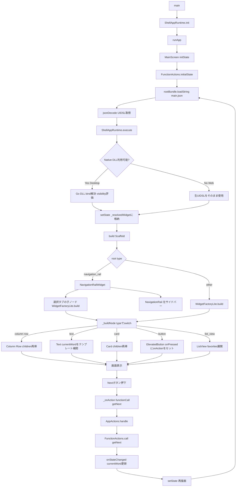

> 🇺🇸 [English version here](README.md)

# ウィジェットを1つも書かずに、Flutter アプリを作れたらどうなる？

---

## Flutter、最近めちゃくちゃ人気よね

iOS / Android / Web / Desktop。  
**1つのコードで全部動く。**  
しかも WebView じゃなくて **ネイティブ描画**。  
そりゃ人気出るよね。

---

## でも、アプリが育つとこうなる…

```dart
// UI とロジックが混ざって、コードがどんどん縦に伸びていく…
if (isLoading) {
  return CircularProgressIndicator();
} else {
  return Column(
    children: [
      Text(userName),
      ElevatedButton(
        onPressed: () => fetchData(),  // ← ここロジック？UI？
        child: Text('更新'),
      ),
    ],
  );
}
```

**UI とロジックが混ざる。  
責務が曖昧になる。  
レビューがしんどい。  
差分が読めない。**

ローコードツールという選択肢もあるけど、  
WebView ベースだったり、Git 管理しづらかったり、審査が重かったり…。

---

## UI を "コード" から "データ" に分離したらどうなる？

- UI を JSON で定義 → **Git で差分管理できる**
- UI とロジックが別ファイル → **デザイナーとエンジニアが並行作業できる**
- JSON をサーバー配信 → **審査なしで画面更新できる**

> ボタンの色を変えるだけで 3 日待つ時代、終わらせよう。

**「UI はデータ」  
その発想が ShellApp。**

---

## ありそうでなかったアプローチ

React、Vue、SwiftUI、Jetpack Compose、Flutter…  
どれも最高。でも全部「UI をコードで書く」前提。

ShellApp は一歩先に行く。

**UI = データ  
ロジック = アクション  
Flutter = レンダラー**

この三層に分けることで、  
アプリ開発の "当たり前" をひっくり返す。

> ShellApp はローコードツールではありません。  
> UI をデータ化する「アーキテクチャ」です。

---

## Flutter 公式コードラボを UIDSL で再現してみた

Flutter 公式の「Your First Flutter App」を、  
**Dart で UI を1行も書かずに**再実装したデモ。

やってることはシンプル。

**JSON（UIDSL）で UI を定義して、  
Flutter に描いてもらうだけ。**

---

## UIDSL はこんな感じ

このボタン ↓

```
[ ❤ Like ]
```

JSON ではこうなる ↓

```json
{
  "type": "button",
  "props": {
    "label": "Like",
    "icon": "favorite"
  },
  "action": {
    "type": "functionCall",
    "name": "toggleFavorite"
  }
}
```

> UI はデータ。  
> ロジックは `toggleFavorite` に任せる。

---

リストもこう書ける ↓

```json
{
  "type": "list_view",
  "bind": "favorites",
  "props": {
    "item_template": {
      "type": "text",
      "bind": ".",
      "props": { "value": "{{.}}" }
    }
  }
}
```

> `bind: "favorites"` で state と自動連動。

---

## UIDSL の action → lib/actions/ の対応

| UIDSL（JSON） | lib/actions/（Dart） | 役割 |
|---|---|---|
| `"functionCall"` | `function_actions.dart` | ビジネスロジック |
| `"apiCall"` | `api_actions.dart` | 外部 API |
| `"storage.save"` | `storage_actions.dart` | ローカル保存 |
| `"navigate"` | `app_actions.dart` | 画面遷移 |

```
[ ❤ Like 押す ]
       ↓
UIDSL: "functionCall" → "toggleFavorite"
       ↓
lib/actions/function_actions.dart の toggleFavorite が動く
       ↓
state 更新 → 自動で UI に反映
```

**分業が自然に成立する。**

```
エンジニア：toggleFavorite を実装
PM / デザイナー：JSON に "toggleFavorite" と書くだけ
```

---

## アーキテクチャ（Mermaid）



---

## Getting Started

> このデモでは「UI を JSON で定義し、Flutter が描画する」という  
> ShellApp の基本思想を体験できます。

**動作環境:** Flutter 3.38.0 以上

```bash
git clone https://github.com/ease-link/FlutterShell_App_Demo.git
cd FlutterShell_App_Demo
flutter run
```

iOS / Android / Web / Desktop  
全部このコマンドで動く。

---

## ディレクトリ構成

```
lib/
  actions/                         # エンジニアの領域：ロジック
    app_actions.dart
    function_actions.dart
    api_actions.dart
    storage_actions.dart
  screens/                         # フレームワーク層
    main_screen.dart
  shellapp/                        # UIDSL → Widget 変換エンジン
    widget_factory_lite.dart
  plugins/
    navigation_rail_widget.dart
  main.dart

assets/
  uidsl/screens/                   # デザイナー・PM の領域
    main.json
```

> 「誰がどこを触るか」をディレクトリ構造で明確化。

---

## 実際に触ってみたい方へ

**[FlutterShell Studio — ライブプレビュー](https://fluttershell.com/preview)**  
UIDSL ベースの画面をビジュアルで作れるツール。コード不要。

---

> **English version** → [README.md](README.md)
