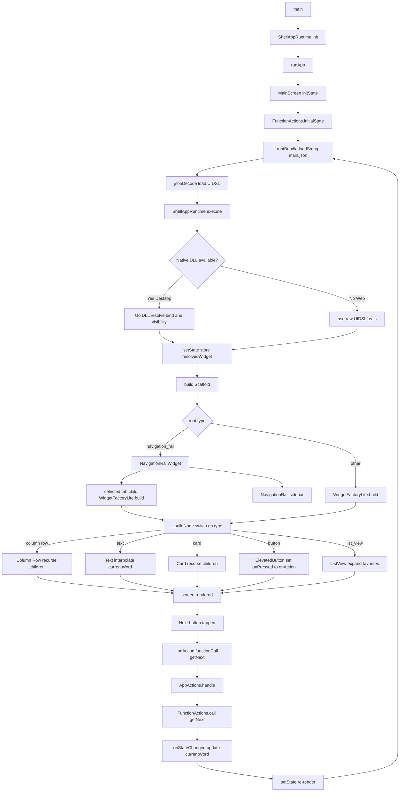

> 🇯🇵 [日本語版はこちら](README.ja.md)

# What if you could build a Flutter app without writing a single Widget?

---

## Flutter is huge right now.

One codebase. iOS, Android, Web, Desktop — all covered.  
Not WebView. **Natively compiled.** That's the real deal.

---

## But does this look familiar?

As your app grows, it starts to look like this.

```dart
// UI and logic tangled together, growing endlessly...
if (isLoading) {
  return CircularProgressIndicator();
} else {
  return Column(
    children: [
      Text(userName),
      ElevatedButton(
        onPressed: () => fetchData(),  // ← logic here? UI here?
        child: Text('Update'),
      ),
    ],
  );
}
```

**Where does the logic end and the UI definition begin? It gets harder to tell.**

"Maybe a low-code tool would solve this?" — that's an option.  
Though many are WebView-based, which brings its own tradeoffs around Git management, native quality, and App Store compliance.

---

## Wait. Could this actually be solved?

What if UI definition was completely separated from code?

- UI defined in JSON → **Git diffs, code reviews, just work**
- UI and logic in separate files → **designers and engineers work in parallel**
- Serve JSON from a server → **update screens without App Store / Play Store review**  
  *(Why does changing a button color take 3 days? The answer is here.)*

**"UI as data." That's the idea behind ShellApp.**

---

## Sounds familiar, yet doesn't exist

Mobile, enterprise, web — across languages and frameworks.  
React, Vue, Swift, Kotlin, Flutter… all great.  
But all of them are about **"how to write UI"** — the UI definition still lives inside the code.

No matter how the language or framework changes, this problem follows you.

ShellApp takes a different approach: **"treat UI definition as data."**  
One step further. (At least, that's the idea.)  
Surprisingly, nothing quite like it existed.

---

## Why this matters

ShellApp is not a low-code tool.  
It's a new way to structure Flutter apps: **UI as data, logic as actions, Flutter as renderer.**  
The same app. The same Flutter. Just a different contract between the people who build it.

---

## Here's what we built

A reimplementation of the **[Flutter official codelab app](https://codelabs.developers.google.com/codelabs/flutter-codelab-first)** — the word generator with favorites — without writing a single line of UI in Dart.

Technically, it's a "**UI framework**." But what it actually does is simple.  
**Define screens in JSON. Let Flutter render them.**

---

## This is what UIDSL looks like

This button ↓

```
[ ❤ Like ]
```

In JSON ↓

```json
{
  "type": "button",
  "props": {
    "label": "Like",
    "icon": "favorite"
  },
  "action": {
    "type": "functionCall",
    "name": "toggleFavorite"
  }
}
```

> Logic is handled by `toggleFavorite`. This is all the UI needs to say.

---

Lists too ↓

```json
{
  "type": "list_view",
  "bind": "favorites",
  "props": {
    "item_template": {
      "type": "text",
      "bind": ".",
      "props": { "value": "{{.}}" }
    }
  }
}
```

> `bind: "favorites"` connects to the state list. Add or remove items — the UI updates instantly.

---

## How UIDSL actions map to lib/actions/

The `action` in JSON maps directly to a file in `lib/actions/`.

| UIDSL (JSON) | lib/actions/ (Dart) | Purpose |
|---|---|---|
| `"type": "functionCall"` | `function_actions.dart` | Business logic, calculations |
| `"type": "apiCall"` | `api_actions.dart` | External API calls |
| `"type": "storage.save"` | `storage_actions.dart` | Local storage |
| `"type": "navigate"` | `app_actions.dart` | Screen navigation |

```
[ ❤ Like button tapped ]
       ↓
UIDSL: "type": "functionCall", "name": "toggleFavorite"
       ↓
lib/actions/function_actions.dart → toggleFavorite runs
       ↓
When the action updates state, ShellApp automatically re-renders the affected widgets.
```

**How the work is divided:**

```
Engineer implements toggleFavorite in lib/actions/
         ↓
Designer / PM writes "name": "toggleFavorite" in JSON
         ↓
No need to know the implementation details to wire it into the UI
```

Think of it like knowing an API endpoint — you don't need to know what's inside to call it.  
Engineers can organize `lib/actions/` however they want. The structure is up to the project.

---

## Architecture

> This diagram is written in [Mermaid](https://mermaid.js.org/) — diagrams in Markdown. Also "managing everything as text."



---

## Getting Started

> **This project contains no Dart UI code.**  
> All screens are defined in JSON (`assets/uidsl/screens/main.json`).

**Requirements:** Flutter 3.38.0 or later

```bash
git clone https://github.com/ease-link/FlutterShell_App_Demo.git
cd FlutterShell_App_Demo
flutter run
```

iOS / Android / Web / Desktop — same command, all platforms.

Clone it. Run it. Then read the code.  
**Something will feel different from a typical Flutter project.**

---

## Project Structure

```
lib/
  actions/                         # ✅ Engineer's zone: implement logic, API, processing
    app_actions.dart               #    action dispatcher
    function_actions.dart          #    business logic (word generation, favorites)
    api_actions.dart               #    external API calls
    storage_actions.dart           #    local storage
  screens/                         # 🔧 Framework: no need to touch
    main_screen.dart               #    state management, UIDSL loading
  shellapp/                        # 🔧 Framework: no need to touch
    widget_factory_lite.dart       #    UIDSL → Flutter Widget engine
  plugins/                         # 🔧 Framework: no need to touch
    navigation_rail_widget.dart    #    NavigationRail plugin
  main.dart                        # 🔧 Framework: no need to touch

assets/
  uidsl/screens/                   # ✅ Designer / PM's zone: define screens in JSON
    main.json                      #    UI definition (UIDSL)
```

> The age-old question — "wait, whose job is this?" — answered by the directory structure.

---

## Want to see it in action?

**[FlutterShell Studio — Live Preview](https://fluttershell.com/preview)**  
Build UIDSL-based screens visually. No code required.

---

> **日本語版** → [README.ja.md](README.ja.md)
