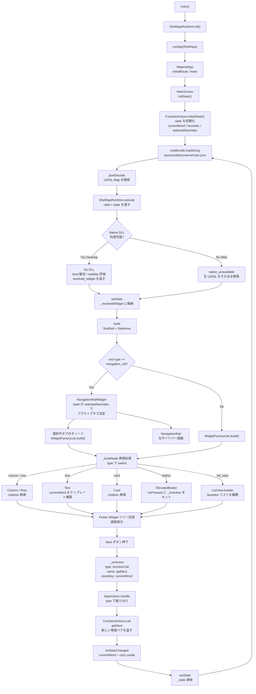

# ShellApp_Codelabs_flutter 起動〜画面描画フロー

---

## 各レイヤーの役割

| レイヤー | ファイル | 役割 |
|---|---|---|
| エントリーポイント | `main.dart` | アプリ初期化・ルーティング定義 |
| 画面ホルダー | `screens/main_screen.dart` | state 管理・UIDSL ロード・再描画サイクル |
| ランタイム | `shellapp_runtime` | bind 解決・visibility 評価（Desktop: Go DLL / Web: スタブ） |
| ビジネスロジック | `actions/function_actions.dart` | 単語生成・お気に入り管理 |
| アクション振り分け | `actions/app_actions.dart` | functionCall / navigate / setState 等を各ハンドラへ委譲 |
| UI プラグイン | `plugins/navigation_rail_widget.dart` | NavigationRail の UIDSL → Widget 変換 |
| Widget 変換エンジン | `shellapp/widget_factory_lite.dart` | UIDSL type → Flutter Widget への再帰変換 |
| UI 定義 | `assets/uidsl/screens/main.json` | 画面構造・バインド・アクションを JSON で記述 |
